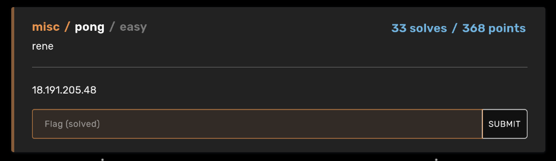
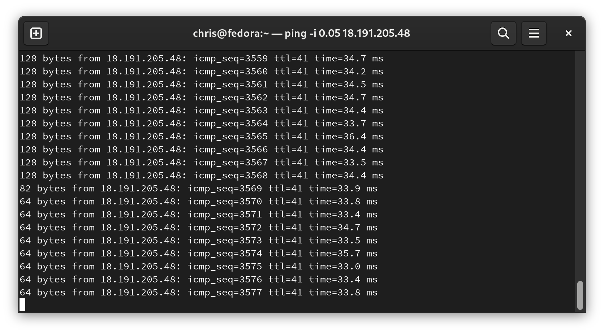

# BuckeyeCTF 2023 "pong" Write Up
September 29th to October 1st 2023 marked the Cyber Security Club @ Ohio State's annual Capture The Flag (CTF) competition where Ohio State undergraduates and other teams from around the world competed to solve a variety of different challenges. This document is a write up detailing one possible solution for a challenge in the miscellaneous category called "pong".

## About the Challenge
Pong is an interesting challenge since unlike most challenges, there was not a short blurb providing a hint as to what possible solutions might be. All we are given is an IP address of a remote machine.



With hindsight it is obvious that the challenge name is the one and only clue as to how we might solve this challenge. However, this is not always the case so my first instinct was not to read into the name. Instead, I wanted to scan the ports of the machine to maybe get an idea as to what applications were running. An ```nmap``` report comes back that this server is locked down pretty tight.


As we can see, the only port that is open is port 22 which is reserved for ```ssh```. So, we are back at square one.

## Ping? Pong?
I alluded to how the challenge name was a hint before, and maybe you have put the pieces together by now. Pong... as in Ping Pong? This is a useful coincidence since ```ping``` is a common command line utility to check and see if other hosts on a network are online. If we ```ping 18.191.205.48```, we can see that it is indeed online and responding to pings.


Now this is where we got quite lucky. We noticed that the ```ping``` responses from the server were returning more data than say something like, ```duckduckgo.com``` or ```osu.edu```.


## Internet Control Message Protocol
When we ```ping``` we are actually sending a packet known as an Internet Control Message Protocol (ICMP) packet. This protocol sits at the Network layer of the TCP/IP stack and allows devices such as routers and end hosts to send simple diagnostic information between to each other. There a few header fields, but also a data field, and we can see that when we compare the ping responses from the CTF host and ```duckduckgo.com```, the CTF host sends us 128 bytes whereas the latter sends us only 64 bytes. Sounds like a good place to look with Wireshark.

When we analyze the ICMP packets with Wireshark, we can see some interesting data in the packet's contents in the bottom right corner of the below image.


Seeing ```PNG``` in the packet contents strongly hints that we may be receiving an image over the course of packets. ```PNG``` images have several headers, such as ```IHDR```, ```IDAT```, and ```IEND```. We want to keep receiving packets until we see that ```IEND``` header because then we know we received a full ```PNG``` image. A smart idea may be to figure out if any information in the headers tells us the size of the image so we can calculate how many packets we might need. Or we can just keep pinging the server and pray that we received the packet containing ```IEND``` (guess which one we did).

By default, the ```ping``` command sends out packets once per second. But as we waited for 500 packets to be received to find out that we had to ```IEND``` header, you can change the rate of the packets being sent out with a ```-i``` flag.

```ping -i 0.05 18.191.205.48```



Let's inspect that packet.


## Putting it all together
Now we have the data for an image distributed across around 3,600 packets. We simply must stitch the data from each packet together, and export that as an image. Luckily, Python and ```pyshark``` make this extremely straightforward. ```pyshark``` is a Python library that enables easy manipulation of Wireshark ```.pcapng``` captures. We can see from Wireshark that the data part of the packet starts at byte 48 onwards, so for each packet we only take that chunk of data and append it to our accumulator variable. Finally we open a file, making sure to tell Python we want to write in binary mode ```wb```, and dump the bytes to said file.

```python
import pyshark
cap = pyshark.FileCapture('withfinal.pcapng')
f = open('image_zoom_demo.png', 'wb')
allbytes = b''
for packet in cap:
    packet_bytes = bytes.fromhex(packet.icmp.data)
    allbytes += packet_bytes[48:]

f.write(allbytes)
f.close()
```

Running the script yields us modern art, with the added benefit of a flag at the bottom right.


